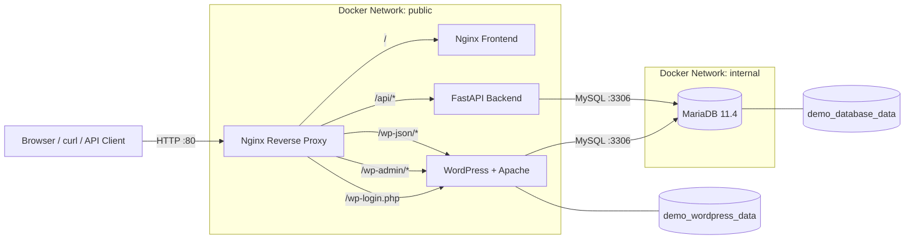

# Docker & Ansible Microservices Platform

A production-style training project that demonstrates how to build, run, and automate a multi-service application using Docker Compose and Ansible.

The platform includes an Nginx reverse proxy, static frontend, FastAPI backend, MariaDB database, WordPress CMS, persistent Docker volumes, isolated networks, health checks, restart policies, log rotation, and Ansible automation with roles, handlers, tags, Jinja2 templates, and Vault.

> Primary local URL: `http://localhost/`

---

## Overview

This project is a complete local microservices lab for Ubuntu or WSL2.

Docker Compose manages:

- images and containers;
- networks and service discovery;
- named volumes;
- service dependencies;
- health checks;
- restart policies;
- logging configuration.

Ansible manages:

- host preparation;
- Docker daemon configuration;
- deployment directories;
- source and configuration synchronization;
- environment-file generation;
- encrypted secrets;
- full-stack and targeted deployments.

The default Ansible deployment directory is:

```text
/opt/training-microservices
```

---

## Architecture



### Main design principles

- The reverse proxy is the normal public entry point.
- MariaDB is not exposed directly to the host.
- Containers communicate through Docker DNS service names.
- Persistent data lives in named volumes.
- Secrets are encrypted with Ansible Vault.
- The runtime `.env` file is generated by Ansible and excluded from Git.

---

## Technology Stack

| Layer | Technology |
|---|---|
| Reverse proxy | Nginx Alpine |
| Frontend | Static HTML, CSS, JavaScript served by Nginx |
| Backend API | FastAPI |
| Application server | Uvicorn |
| ORM | SQLAlchemy |
| Database driver | PyMySQL |
| Database | MariaDB 11.4 |
| CMS | WordPress with Apache |
| Container orchestration | Docker Compose v2 |
| Automation | Ansible |
| Secret management | Ansible Vault |
| Templates | Jinja2 |
| Source control | Git |

---

## Service Responsibilities

### Reverse proxy

Image:

```text
nginx:alpine
```

Responsibilities:

- expose host port `80`;
- route frontend traffic;
- remove the public `/api/` prefix before forwarding backend requests;
- route WordPress REST, administration, and login traffic;
- forward client and protocol headers.

### Frontend

Responsibilities:

- serve the browser interface;
- load backend messages;
- load WordPress posts;
- display API errors.

Use relative URLs:

```javascript
fetch("/api/messages");
fetch("/wp-json/posts");
```

Do not hard-code development ports in frontend code.

### Backend

Responsibilities:

- expose REST endpoints;
- validate request and response models;
- create and query application tables;
- report database health;
- connect to MariaDB using SQLAlchemy.

### Database

Image:

```text
mariadb:11.4
```

Responsibilities:

- store backend records;
- store WordPress tables;
- persist data through a named volume;
- accept traffic only through Docker networks.

### WordPress

Image:

```text
wordpress:php8.3-apache
```

Responsibilities:

- provide CMS content;
- expose WordPress REST data;
- provide administration and login pages;
- store files in a named volume;
- use MariaDB as its database.

---

## Request Flow

### Frontend

```text
Browser
  -> http://localhost/
  -> proxy:80
  -> frontend:80
  -> index.html
```

### Backend

```text
Browser
  -> http://localhost/api/messages
  -> proxy
  -> backend:8000/messages
  -> SQLAlchemy
  -> MariaDB
```

The Nginx rule:

```nginx
location /api/ {
    proxy_pass http://backend:8000/;
}
```

maps:

```text
/api/messages -> /messages
/api/health   -> /health
```

The trailing slash in `proxy_pass` is required for this behavior.

### WordPress

```text
Browser
  -> http://localhost/wp-json/posts
  -> proxy
  -> WordPress REST API
  -> MariaDB
```

---

## Repository Structure

```text
Demo/
├── compose.yml
├── README.md
├── .env
├── .env.example
├── .gitignore
├── .dockerignore
│
├── backend/
│   ├── Dockerfile
│   ├── .dockerignore
│   ├── requirements.txt
│   └── app/
│       ├── __init__.py
│       ├── database.py
│       ├── main.py
│       ├── models.py
│       └── schemas.py
│
├── frontend/
│   ├── Dockerfile
│   └── index.html
│
├── proxy/
│   └── default.conf
│
└── ansible/
    ├── ansible.cfg
    ├── inventory/
    │   └── hosts.ini
    ├── group_vars/
    │   └── all/
    │       ├── main.yml
    │       └── vault.yml
    ├── playbooks/
    │   └── site.yml
    └── roles/
        ├── docker_daemon/
        │   ├── tasks/main.yml
        │   ├── handlers/main.yml
        │   └── templates/daemon.json.j2
        ├── common/
        │   ├── tasks/main.yml
        │   ├── handlers/main.yml
        │   └── templates/env.j2
        ├── database/
        │   └── tasks/main.yml
        ├── backend/
        │   └── tasks/main.yml
        ├── frontend/
        │   └── tasks/main.yml
        ├── wordpress/
        │   └── tasks/main.yml
        └── proxy/
            └── tasks/main.yml
```

---

## Prerequisites

Recommended environment:

- Ubuntu 22.04 or later;
- WSL2 Ubuntu on Windows;
- Docker Engine;
- Docker Compose v2;
- Python 3;
- Git;
- Ansible;
- `rsync`;
- `ansible.posix` collection.

Verify:

```bash
docker --version
docker compose version
python3 --version
git --version
ansible --version
```

Install the POSIX collection when required:

```bash
ansible-galaxy collection install ansible.posix
```

---

## Environment Variables

Create the local environment file:

```bash
cp .env.example .env
```

Example:

```dotenv
DB_ROOT_PASSWORD=replace_with_a_strong_root_password

APP_DB_NAME=app_db
APP_DB_USER=app_user
APP_DB_PASSWORD=replace_with_a_strong_app_password

WP_DB_NAME=wordpress_db
WP_DB_USER=wordpress_user
WP_DB_PASSWORD=replace_with_a_strong_wordpress_password

BACKEND_IMAGE_TAG=v1
FRONTEND_IMAGE_TAG=v1
```

Never commit `.env`.

Recommended `.gitignore` entries:

```gitignore
.env
backend/.venv/
__pycache__/
*.pyc
*.pyo
*.retry
```

---

## Run with Docker Compose

Validate:

```bash
docker compose config
```

Build and start:

```bash
docker compose up -d --build
```

Check status:

```bash
docker compose ps
```

View logs:

```bash
docker compose logs -f
```

Stop while preserving data:

```bash
docker compose down
```

Start again:

```bash
docker compose up -d
```

Do not run this unless permanent data deletion is intended:

```bash
docker compose down -v
```

---

## Application Endpoints

| Endpoint | Description |
|---|---|
| `http://localhost/` | Main frontend |
| `http://localhost/api/` | Backend root |
| `http://localhost/api/health` | Backend and database health |
| `http://localhost/api/messages` | List or create messages |
| `http://localhost/wp-json/posts` | WordPress posts |
| `http://localhost/wp-admin/` | WordPress administration |
| `http://localhost/wp-login.php` | WordPress login |
| `http://localhost:8000/docs` | Direct FastAPI Swagger UI |
| `http://localhost:8000/redoc` | Direct FastAPI ReDoc |
| `http://localhost:8081/` | Direct frontend debugging |
| `http://localhost:8082/` | Direct WordPress debugging |

---

## Backend API

### Root

```bash
curl http://localhost/api/
```

### Health

```bash
curl http://localhost/api/health
```

Example:

```json
{
  "status": "healthy",
  "database": "connected"
}
```

### List messages

```bash
curl http://localhost/api/messages
```

### Create a message

```bash
curl   -X POST   http://localhost/api/messages   -H 'Content-Type: application/json'   -d '{"content":"Created through the reverse proxy"}'
```

---

## WordPress Integration

Posts:

```bash
curl http://localhost/wp-json/posts
```

Administration:

```text
http://localhost/wp-admin/
```

Login:

```text
http://localhost/wp-login.php
```

Direct development access:

```text
http://localhost:8082/
```

Depending on permalink configuration, direct REST access may use:

```text
http://localhost:8082/index.php?rest_route=/wp/v2/posts
```

---

## Networking

### Internal network

```yaml
networks:
  internal:
    internal: true
```

Connected services:

- database;
- backend;
- WordPress.

Purpose:

- isolate database traffic;
- prevent direct external database access;
- allow internal service discovery.

### Public network

Connected services:

- proxy;
- frontend;
- backend;
- WordPress.

### Docker DNS

Services communicate by name:

```text
backend
frontend
wordpress
database
```

Examples:

```text
http://backend:8000
http://frontend:80
http://wordpress:80
database:3306
```

Do not hard-code container IP addresses.

---

## Persistent Storage

### Database volume

```text
demo_database_data
```

Mounted at:

```text
/var/lib/mysql
```

### WordPress volume

```text
demo_wordpress_data
```

Mounted at:

```text
/var/www/html
```

The Compose project name is fixed:

```yaml
name: demo
```

This keeps resource names stable when Compose runs from another directory.

---

## Health Checks and Dependencies

### MariaDB

```yaml
healthcheck:
  test:
    - CMD
    - healthcheck.sh
    - --connect
    - --innodb_initialized
  interval: 5s
  timeout: 5s
  retries: 20
  start_period: 15s
```

### Backend

```yaml
healthcheck:
  test:
    - CMD
    - python
    - -c
    - "import urllib.request; urllib.request.urlopen('http://localhost:8000/health', timeout=3)"
  interval: 10s
  timeout: 5s
  retries: 5
  start_period: 15s
```

The backend waits for MariaDB:

```yaml
depends_on:
  database:
    condition: service_healthy
```

---

## Logging

Services use Docker's `json-file` logging driver with rotation:

```yaml
logging:
  driver: json-file
  options:
    max-size: "10m"
    max-file: "3"
```

View logs:

```bash
docker compose logs --tail 100
docker compose logs -f backend
docker compose logs -f proxy
```

---

## Ansible Automation

Execution flow:

```text
ansible.cfg
  -> inventory/hosts.ini
  -> playbooks/site.yml
  -> group_vars/all/main.yml
  -> decrypt group_vars/all/vault.yml
  -> docker_daemon role
  -> common role
  -> database role
  -> backend role
  -> frontend role
  -> WordPress role
  -> proxy role
  -> queued handlers
```

### Inventory

```ini
[app_servers]
localhost ansible_connection=local
```

### Role responsibilities

| Role | Responsibility |
|---|---|
| `docker_daemon` | Manage `/etc/docker/daemon.json`, validate, and reload Docker |
| `common` | Install packages, create deployment directory, copy Compose, render `.env` |
| `database` | Ensure MariaDB is running |
| `backend` | Synchronize source, build, and deploy FastAPI |
| `frontend` | Copy source, build, and deploy frontend |
| `wordpress` | Ensure WordPress is running |
| `proxy` | Copy Nginx configuration and recreate proxy |

---

## Ansible Variable Flow

Non-secret values:

```text
ansible/group_vars/all/main.yml
```

Secrets:

```text
ansible/group_vars/all/vault.yml
```

Complete secret flow:

```text
encrypted vault.yml
  -> Vault password
  -> Ansible variable
  -> Jinja2 env.j2
  -> /opt/training-microservices/.env
  -> Docker Compose substitution
  -> container environment
  -> application
```

Runtime variables can be registered:

```yaml
register: backend_source
```

Then used conditionally:

```yaml
when:
  - backend_source.changed
  - not ansible_check_mode
```

---

## Ansible Vault

Create:

```bash
ansible-vault create group_vars/all/vault.yml
```

Encrypt:

```bash
ansible-vault encrypt group_vars/all/vault.yml
```

View:

```bash
ansible-vault view group_vars/all/vault.yml
```

Edit:

```bash
ansible-vault edit group_vars/all/vault.yml
```

Rekey:

```bash
ansible-vault rekey group_vars/all/vault.yml
```

The encrypted file begins with:

```text
$ANSIBLE_VAULT;1.1;AES256
```

Docker Compose cannot read a Vault-encrypted `.env` directly. The correct pattern is:

```text
Vault variables -> Jinja2 template -> plaintext .env with mode 0600
```

---

## Deployment Commands

Enter the Ansible directory:

```bash
cd ~/Projects/Demo/ansible
```

Test inventory:

```bash
ansible app_servers -m ping
```

Syntax check:

```bash
ansible-playbook   playbooks/site.yml   --syntax-check   --ask-vault-pass
```

Dry run:

```bash
ansible-playbook   playbooks/site.yml   --check   --diff   --ask-become-pass   --ask-vault-pass
```

Full deployment:

```bash
ansible-playbook   playbooks/site.yml   --ask-become-pass   --ask-vault-pass
```

Successful recap:

```text
failed=0
unreachable=0
```

---

## Targeted Deployments

Backend:

```bash
ansible-playbook playbooks/site.yml --tags backend --ask-become-pass --ask-vault-pass
```

Frontend:

```bash
ansible-playbook playbooks/site.yml --tags frontend --ask-become-pass --ask-vault-pass
```

Database:

```bash
ansible-playbook playbooks/site.yml --tags database --ask-become-pass --ask-vault-pass
```

WordPress:

```bash
ansible-playbook playbooks/site.yml --tags wordpress --ask-become-pass --ask-vault-pass
```

Proxy:

```bash
ansible-playbook playbooks/site.yml --tags proxy --ask-become-pass --ask-vault-pass
```

Docker daemon configuration:

```bash
ansible-playbook playbooks/site.yml --tags docker_config --ask-become-pass --ask-vault-pass
```

---

## Verification

```bash
echo "=== FRONTEND ==="
curl -I http://localhost/

echo "=== BACKEND HEALTH ==="
curl http://localhost/api/health
echo

echo "=== BACKEND MESSAGES ==="
curl http://localhost/api/messages
echo

echo "=== WORDPRESS POSTS ==="
curl http://localhost/wp-json/posts
echo
```

Check deployed services:

```bash
cd /opt/training-microservices
docker compose ps
```

---

## Persistence Test

Create a message:

```bash
curl   -X POST   http://localhost/api/messages   -H 'Content-Type: application/json'   -d '{"content":"Persistent message"}'
```

Recreate containers without deleting volumes:

```bash
docker compose down
docker compose up -d
```

Verify:

```bash
curl http://localhost/api/messages
```

---

## Docker Image Cleanup

Inspect:

```bash
docker images
docker system df
```

Remove a specific image:

```bash
docker rmi IMAGE_NAME:TAG
```

Remove dangling images:

```bash
docker image prune -f
```

Remove unused build cache:

```bash
docker builder prune -a -f
```

Remove unused images, stopped containers, networks, and build cache:

```bash
docker system prune -a
```

Do not add `--volumes` unless deleting MariaDB and WordPress data is intentional.

---

## Troubleshooting

### Frontend returns 404

Correct JavaScript:

```javascript
fetch("/api/messages");
```

Rebuild:

```bash
docker compose build --no-cache frontend
docker compose up -d --force-recreate frontend
```

### Proxy returns 404

Verify:

```nginx
proxy_pass http://backend:8000/;
```

Validate:

```bash
docker compose run --rm proxy nginx -t
```

### Ansible role not found

Ensure:

```ini
roles_path = ./roles
```

Run from:

```bash
cd ~/Projects/Demo/ansible
```

### Backend synchronization copies `.venv`

Exclude it:

```yaml
rsync_opts:
  - "--exclude=/.venv/"
  - "--exclude=venv/"
  - "--exclude=__pycache__/"
  - "--exclude=*.pyc"
```

### Check mode fails on deployment commands

Use:

```yaml
when: not ansible_check_mode
```

### WordPress cannot connect to MariaDB

Verify:

- host is `database:3306`;
- database and user exist;
- passwords match;
- both services share the internal network.

---

## Security Considerations

Before production use:

- expose only the reverse proxy;
- remove host ports `8000`, `8081`, and `8082`;
- enable HTTPS;
- restrict CORS;
- use strong unique passwords;
- protect the Vault password;
- never commit `.env`;
- keep `vault.yml` encrypted;
- use a dedicated deployment user;
- enable SSH host-key checking for remote hosts;
- use immutable image versions;
- scan images;
- automate backups;
- use least-privilege database users.

---

## Recommended Improvements

### Docker

- add frontend and WordPress health checks;
- add resource limits;
- run containers as non-root;
- pin image versions or digests;
- scan images for vulnerabilities.

### Database

- automate WordPress database initialization;
- add migration management;
- schedule backups;
- test restores.

### Nginx

- add TLS;
- add security headers;
- add rate limiting;
- validate config before recreation.

### Ansible

- replace shell commands with `community.docker.docker_compose_v2`;
- deploy from Git instead of a local working tree;
- add development, staging, and production inventories;
- add post-deployment health assertions;
- add rollback support.

### CI/CD

- validate Compose;
- lint Python and Ansible;
- test FastAPI endpoints;
- build and scan images;
- deploy only after successful tests.

---

## Learning Outcomes

This project demonstrates:

- Docker image and container fundamentals;
- Dockerfile builds;
- Docker Compose orchestration;
- Docker DNS and networking;
- persistent named volumes;
- Nginx reverse proxy routing;
- FastAPI and MariaDB integration;
- WordPress with an external database;
- health checks and restart policies;
- log rotation;
- Ansible inventories, roles, handlers, and tags;
- Jinja2 templates;
- Ansible Vault;
- check mode and idempotency;
- targeted service deployment.

---

## Quick Start

### Docker Compose

```bash
cp .env.example .env
docker compose config
docker compose up -d --build
docker compose ps
curl http://localhost/api/health
```

Open:

```text
http://localhost/
```

### Ansible

```bash
cd ansible

ansible app_servers -m ping

ansible-playbook   playbooks/site.yml   --syntax-check   --ask-vault-pass

ansible-playbook   playbooks/site.yml   --check   --diff   --ask-become-pass   --ask-vault-pass

ansible-playbook   playbooks/site.yml   --ask-become-pass   --ask-vault-pass
```

---

## License

Add the license appropriate for the repository, such as MIT, Apache-2.0, or a private internal-use notice.
